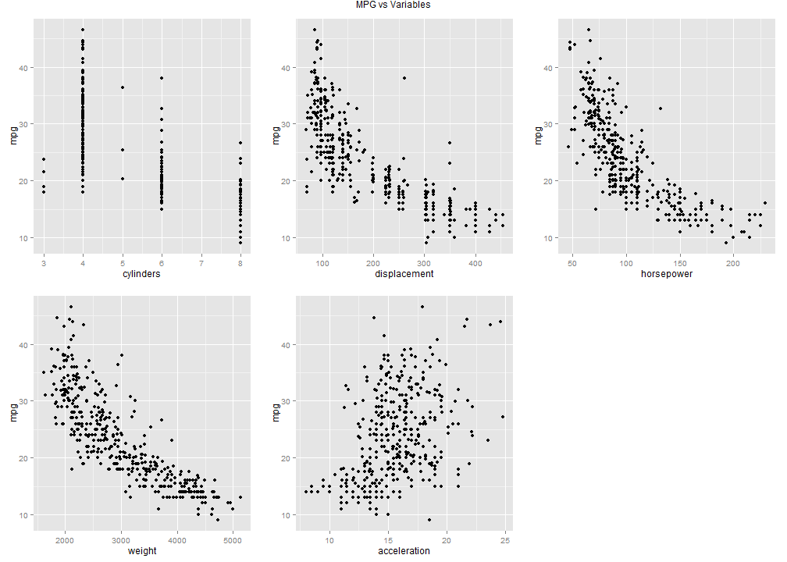

Developing Data Products Project
========================================================
author: Miadad Rashid
date: 10/25/2014

What if?
========================================================

...you were really short on cash.  And you had to drive from various places over a long period time in order to deliver sensitive documents for Russian mobster who has both your kittens and comic book collection hostage.  Here's the catch, you were transported back in time to the 1970s by the mobster's Grand Daughter whom infused you with the knowledge of basic C programming and networking theory so once you get there you can invent the internet and programming languages which can utilize prediction algorithms and such.  You will....

- Need a car to get around
- You will need to find the most efficient car before you run out of money


What I have done for you
========================================================
Well luckily, I have this data set that shows attributes of various cars from the 70s.  From that I have made an app to help you in your adventure.

```r
library(ISLR)
data(Auto)
head(Auto[,1:6])
```

```
  mpg cylinders displacement horsepower weight acceleration
1  18         8          307        130   3504         12.0
2  15         8          350        165   3693         11.5
3  18         8          318        150   3436         11.0
4  16         8          304        150   3433         12.0
5  17         8          302        140   3449         10.5
6  15         8          429        198   4341         10.0
```

Individual Variable Comparisons
========================================================
 


Want this lifesaving, time-transcending App?
========================================================


